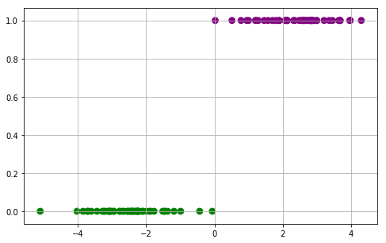

### Questions
* 

### Objectives
YWBAT
* give 3 examples of when logistic regression is used in the real world
    * Credit Approval
    * Something binary yes vs no
    * Disease prediction
    * Multi Class Labeling-> Multiple Models
* explain how linear regression is tied to logistic regression
* explain the purpose of a sigmoid function
* When does a high vs low threshold in logistic regression predictions

### Outline


```python
import pandas as pd
import numpy as np

from sklearn.linear_model import LogisticRegression, LogisticRegressionCV
from sklearn.metrics import confusion_matrix
from sklearn.model_selection import train_test_split
from sklearn.datasets import make_blobs


import matplotlib.pyplot as plt
import seaborn as sns
```

### What is a possible scenario for X and Y
* X represents the number of purchases made compared to mean number of purchases
* Y represents if that client is going to renew their subscription

### Let's load in some mocked data


```python
df = pd.read_csv("data.csv")
x = df["x"]
y = df["y"]
df.head()
```


<div>
<style scoped>
    .dataframe tbody tr th:only-of-type {
        vertical-align: middle;
    }

    .dataframe tbody tr th {
        vertical-align: top;
    }

    .dataframe thead th {
        text-align: right;
    }
</style>
<table border="1" class="dataframe">
  <thead>
    <tr style="text-align: right;">
      <th></th>
      <th>x</th>
      <th>y</th>
    </tr>
  </thead>
  <tbody>
    <tr>
      <td>0</td>
      <td>0.514780</td>
      <td>1.0</td>
    </tr>
    <tr>
      <td>1</td>
      <td>-3.279173</td>
      <td>0.0</td>
    </tr>
    <tr>
      <td>2</td>
      <td>-3.845859</td>
      <td>0.0</td>
    </tr>
    <tr>
      <td>3</td>
      <td>0.947575</td>
      <td>1.0</td>
    </tr>
    <tr>
      <td>4</td>
      <td>1.884433</td>
      <td>1.0</td>
    </tr>
  </tbody>
</table>
</div>


### Plotting our points with color


```python
color_dict = {0: 'green', 1: 'purple'}
colors = [color_dict[j] for j in y]


plt.figure(figsize=(8, 5))
plt.grid()
plt.scatter(x, y, color=colors, s=60)
plt.show()

# If a client is at x = -3, -3 purchases under
# This client probably will not renew (Y=0)

# Who is a client with a high probability of renewing?
# Anyone positive (x-value) is going to renew (we predict). 

# We will have a hard time predicting around 0, since we have a y=0 and y=1 at x = 0
```





### Why is Linear Regression no longer sufficient?

Because it's unbounded and our y-values are bound to 0 and 1


We put our linear regression into a transformation function

### How can we estimate these points?     

$$f(x)= \frac{1}{1 + e^{-c_1(x - c_2)}}$$ 


```python
def sigmoid(x, b0=0, b1=4):
    num = 1
    den = 1 + np.exp(-(b0 + b1*x))
    return num/den
```


```python
# get the y_preds
y_pred = sigmoid(x, 0, 4)
```


```python
def make_plot(x, y, y_pred):
    # Plot both our predictions and out points 
# We need a color dictionary
    color_dict = {0: 'green', 1: 'purple'}
    colors = [color_dict[j] for j in y]


    plt.figure(figsize=(8, 5))
    plt.grid()
    plt.scatter(x, y, color=colors, s=60)
    plt.scatter(x, y_pred)
    plt.show()
```


```python
make_plot(x, y, y_pred)
```


### Why are these labels better than our y_preds
    * We can start predicting once we have labels

### What are the y_pred values similar to? Probability


```python
def get_labels(y_pred, thresh=0.50):
    labels = []
    for pred in y_pred:
        if pred <= 0.50:
            labels.append(0)
        else:
            labels.append(1)
    return labels
```


```python
y_pred_labels = get_labels(y_pred)
```


```python
pndict = get_p_n_dict(y, y_pred_labels)
print(pndict)
accuracy(pndict), recall(pndict), precision(pndict), f1(pndict)
```

    {'TP': 50, 'FP': 1, 'TN': 49, 'FN': 0}


    (0.99, 1.0, 0.9803921568627451, 0.99009900990099)


```python
def get_p_n_dict(y_true, y_pred):
    p_n_dict = {"TP": 0, "FP": 0, "TN": 0, "FN": 0}
    for actual, pred in zip(y_true, y_pred):
        if pred == 0:
            if actual == 1:
                p_n_dict["FN"] += 1
            if actual == 0:
                p_n_dict["TN"] += 1
        if pred == 1:
            if actual == 1:
                p_n_dict["TP"] += 1
            if actual == 0:
                p_n_dict["FP"] += 1
    return p_n_dict


# False Negative Rate
# Use when: contagious disease testing
# False Negative -> someone isn't sick when they are
# Better safe than sorry method
def recall(pndict):
    num = pndict["TP"]
    den = pndict["TP"] + pndict["FN"]
    return num/den

# False Positive Rate
# Use when: credit approval
# False Positive -> you approved a loan to a person that can't pay it back
# Really careful on what you want to call a 1 vs a 0. 
def precision(pndict):
    num = pndict["TP"]
    den = pndict["TP"] + pndict["FP"]
    return num/den


# Harmonic mean of recall and precision
def f1(pndict):
    num = 2 * precision(pndict) * recall(pndict)
    den = precision(pndict) + recall(pndict)
    return num/den


# How much did I get correct? 
# Prone to overfitting on imbalanced data
def accuracy(pndict):
    num = pndict["TP"] + pndict["TN"]
    den = sum(pndict.values())
    return num/den
```


```python
# How can we measure our 'goodness' of fit?
labels = get_labels(y_pred)
pndict = get_p_n_dict(y, labels)
```


```python
accuracy(pndict)
```


    0.99


```python
# get new labels based on a threshold
labels = get_labels(y_pred)
pndict = get_p_n_dict(y, labels)
recall(pndict), precision(pndict), accuracy(pndict), f1(pndict)
```


    (1.0, 0.9803921568627451, 0.99, 0.99009900990099)


```python
cm = confusion_matrix(y, labels)
cm
```


    array([[49,  1],
           [ 0, 50]])


```python
def plot_confusion(y_true, y_pred):
    cm = confusion_matrix(y_true, y_pred)
    plt.figure(figsize=(8, 8))
    sns.heatmap(cm, annot=True, cmap=sns.color_palette('Purples'), fmt='0g', annot_kws={"ha":"center", "va":"top"})
    sns.heatmap(cm/np.sum(cm), annot=True, cmap=sns.color_palette('Purples'), fmt='0.01%', annot_kws={"ha":"center", "va":"bottom"})
    plt.xlabel("Pred", fontsize=16)
    plt.ylabel("Actual", fontsize=16)
    plt.show()
```


```python
plot_confusion(y, labels)
```


### What about thresholds?


```python
def get_labels(y_pred, thresh=0.50):
    labels = []
    for pred in y_pred:
        if pred <= 0.50:
            labels.append(0)
        else:
            labels.append(1)
    return labels
```


```python
logreg = LogisticRegression(fit_intercept=False, penalty='l2', n_jobs=-1, solver='lbfgs')
```


```python
xtrain, xtest, ytrain, ytest = train_test_split(x, y, train_size=0.80)
```


```python
logreg.fit(xtrain.values.reshape(-1, 1), ytrain.values.reshape(-1, 1))
```

    /Users/rafael/anaconda3/envs/flatiron-env/lib/python3.6/site-packages/sklearn/utils/validation.py:724: DataConversionWarning: A column-vector y was passed when a 1d array was expected. Please change the shape of y to (n_samples, ), for example using ravel().
      y = column_or_1d(y, warn=True)


    LogisticRegression(C=1.0, class_weight=None, dual=False, fit_intercept=False,
                       intercept_scaling=1, l1_ratio=None, max_iter=100,
                       multi_class='warn', n_jobs=-1, penalty='l2',
                       random_state=None, solver='lbfgs', tol=0.0001, verbose=0,
                       warm_start=False)


```python
### out of the box predictions using sklearn uses 50% threshold
logreg.predict(xtest.values.reshape(-1, 1))
```


    array([0., 1., 0., 0., 0., 1., 1., 1., 1., 0., 1., 0., 0., 1., 1., 0., 0.,
           0., 0., 0.])


```python
probs = logreg.predict_proba(x.values.reshape(-1, 1)) 

probs[:5] # Prob(0|x), Prob(1|x)
```


    array([[2.53203038e-01, 7.46796962e-01],
           [9.98982972e-01, 1.01702822e-03],
           [9.99690584e-01, 3.09415948e-04],
           [1.20156988e-01, 8.79843012e-01],
           [1.87180482e-02, 9.81281952e-01]])


```python
def get_labels_predict_proba(probs, thresh=0.50):
    labels = []
    for prob in probs:
        if prob[1] >= thresh:
            labels.append(1)
        else:
            labels.append(0)
    return labels
```


```python
new_labels = get_labels_predict_proba(probs, thresh=0.50)
```


```python
plot_confusion(y, new_labels)
```


```python
logreg.coef_, logreg.intercept_
```


    (array([[2.10109466]]), array([0.]))


```python
from sklearn.model_selection import cross_val_score
from sklearn.metrics import recall_score, precision_score, f1_score, make_scorer
```


```python
cv = cross_val_score(logreg,x.values.reshape(-1, 1), y.values.reshape(-1, 1), cv=5, scoring=make_scorer(f1_score))
cv
```

    /Users/rafael/anaconda3/envs/flatiron-env/lib/python3.6/site-packages/sklearn/utils/validation.py:724: DataConversionWarning: A column-vector y was passed when a 1d array was expected. Please change the shape of y to (n_samples, ), for example using ravel().
      y = column_or_1d(y, warn=True)
    /Users/rafael/anaconda3/envs/flatiron-env/lib/python3.6/site-packages/sklearn/utils/validation.py:724: DataConversionWarning: A column-vector y was passed when a 1d array was expected. Please change the shape of y to (n_samples, ), for example using ravel().
      y = column_or_1d(y, warn=True)
    /Users/rafael/anaconda3/envs/flatiron-env/lib/python3.6/site-packages/sklearn/utils/validation.py:724: DataConversionWarning: A column-vector y was passed when a 1d array was expected. Please change the shape of y to (n_samples, ), for example using ravel().
      y = column_or_1d(y, warn=True)
    /Users/rafael/anaconda3/envs/flatiron-env/lib/python3.6/site-packages/sklearn/utils/validation.py:724: DataConversionWarning: A column-vector y was passed when a 1d array was expected. Please change the shape of y to (n_samples, ), for example using ravel().
      y = column_or_1d(y, warn=True)
    /Users/rafael/anaconda3/envs/flatiron-env/lib/python3.6/site-packages/sklearn/utils/validation.py:724: DataConversionWarning: A column-vector y was passed when a 1d array was expected. Please change the shape of y to (n_samples, ), for example using ravel().
      y = column_or_1d(y, warn=True)


    array([1., 1., 1., 1., 1.])


```python

```


```python

```


```python

```

### Assessment
- Learned about thresholds and how to set thresholds
- Pros and cons for labeling function
- I learned how to put both numbers and percentages on heatmap
- Sigmoid can be interpreted as a probability function, though it isn't exclusively one
- Confusion Matrix analysis separates the wheat and the chaff 
